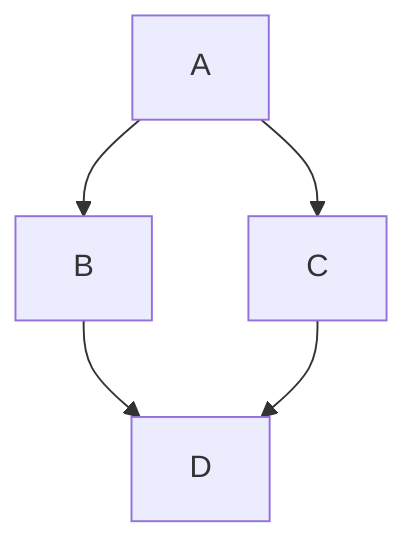

Здесь представлены некоторые расширенные функции Markdown, поддерживаемые темой Retypeset, включая примеры синтаксиса и их стилистические эффекты.

## Подписи к изображениям

Для создания автоматических подписей к изображениям используйте стандартный синтаксис изображений Markdown ``. Чтобы скрыть подпись, добавьте подчёркивание `_` перед текстом `alt` или оставьте текст `alt` пустым.

### Синтаксис

```


```

### Результат


## Блоки примечаний

Для создания блоков примечаний используйте синтаксис GitHub `> [!TYPE]` или контейнерную директиву `:::type`. Поддерживаются следующие типы: `note`, `tip`, `important`, `warning` и `caution`.

### Синтаксис

```
> [!NOTE]
> Полезная информация, которую пользователи должны знать, даже при беглом просмотре.

> [!TIP]
> Полезные советы, как делать что-то лучше или проще.

> [!IMPORTANT]
> Ключевая информация, которую пользователи должны знать для достижения своей цели.

:::warning
Срочная информация, требующая немедленного внимания пользователя для предотвращения проблем.
:::

:::caution
Предупреждает о рисках или негативных последствиях определённых действий.
:::

:::note[ПОЛЬЗОВАТЕЛЬСКИЙ ЗАГОЛОВОК]
Это примечание с пользовательским заголовком.
:::
```

### Результат

> [!NOTE]
> Полезная информация, которую пользователи должны знать, даже при беглом просмотре.

> [!TIP]
> Полезные советы, как делать что-то лучше или проще.

> [!IMPORTANT]
> Ключевая информация, которую пользователи должны знать для достижения своей цели.

:::warning
Срочная информация, требующая немедленного внимания пользователя для предотвращения проблем.
:::

:::caution
Предупреждает о рисках или негативных последствиях определённых действий.
:::

:::note[ПОЛЬЗОВАТЕЛЬСКИЙ ЗАГОЛОВОК]
Это примечание с пользовательским заголовком.
:::

## Сворачиваемые разделы

Для создания сворачиваемых разделов используйте синтаксис контейнерной директивы `:::fold[title]`. Нажмите на заголовок, чтобы развернуть или свернуть раздел.

### Синтаксис

```
:::fold[Советы по использованию]
Контент, который может не заинтересовать всех читателей, можно поместить в сворачиваемый раздел.
:::
```

### Результат

:::fold[Советы по использованию]
Контент, который может не заинтересовать всех читателей, можно поместить в сворачиваемый раздел.
:::

## Диаграммы Mermaid

Для создания диаграмм Mermaid оберните синтаксис Mermaid в блоки кода и укажите тип языка как `mermaid`.

### Синтаксис

``````

``````

### Результат


## Галереи

Для создания галерей изображений используйте контейнерную директиву `:::gallery`. Прокручивайте горизонтально, чтобы просмотреть больше изображений.

### Синтаксис

```
:::gallery


:::
```

### Результат

:::gallery


:::

## Репозитории GitHub

Для встраивания репозиториев GitHub используйте листовую директиву `::github{repo="owner/repo"}`.

### Синтаксис

```
::github{repo="radishzzz/astro-theme-retypeset"}
```

### Результат

::github{repo="radishzzz/astro-theme-retypeset"}

## Видео

Для встраивания видео используйте листовую директиву `::youtube{id="video-id"}`.

### Синтаксис

```
::youtube{id="9pP0pIgP2kE"}

::bilibili{id="BV1sK4y1Z7KG"}
```

### Результат

::youtube{id="9pP0pIgP2kE"}

::bilibili{id="BV1sK4y1Z7KG"}

## Spotify

Для встраивания контента Spotify используйте листовую директиву `::spotify{url="spotify-url"}`.

### Синтаксис

```
::spotify{url="https://open.spotify.com/track/0HYAsQwJIO6FLqpyTeD3l6"}

::spotify{url="https://open.spotify.com/album/03QiFOKDh6xMiSTkOnsmMG"}
```

### Результат

::spotify{url="https://open.spotify.com/track/0HYAsQwJIO6FLqpyTeD3l6"}

::spotify{url="https://open.spotify.com/album/03QiFOKDh6xMiSTkOnsmMG"}

## Твиты

Для встраивания твитов используйте листовую директиву `::tweet{url="tweet-url"}`.

### Синтаксис

```
::tweet{url="https://x.com/hachi_08/status/1906456524337123549"}
```

### Результат

::tweet{url="https://x.com/hachi_08/status/1906456524337123549"}

## CodePen

Для встраивания демо CodePen используйте листовую директиву `::codepen{url="codepen-url"}`.

### Синтаксис

```
::codepen{url="https://codepen.io/jh3y/pen/NWdNMBJ"}
```

### Результат

::codepen{url="https://codepen.io/jh3y/pen/NWdNMBJ"}
